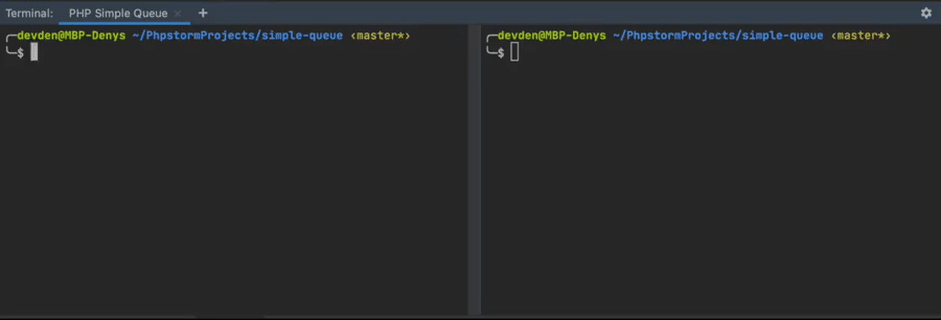

<p align="center">
    <h1 align="center">PHP Simple Queue</h1>
</p>

<p align="center">
    <a href="https://packagist.org/packages/nepster-web/php-simple-queue"></a>
    <a href="https://travis-ci.org/github/nepster-web/php-simple-queue"></a>
    <a href="https://scrutinizer-ci.com/g/nepster-web/php-simple-queue/?b=master"></a>
    <a href="https://packagist.org/packages/nepster-web/php-simple-queue"></a>
    <a href="https://packagist.org/packages/nepster-web/php-simple-queue"></a>
</p>

<p align="center">
    
</p>


Introduction
------------

**PHP Simple Queue** - a library for running tasks asynchronously via queues.
It is production ready, battle-tested a simple messaging solution for PHP.

It supports queues based on **DB**.

Requirements
------------

You'll need at least PHP 7.4 (it works best with PHP 8).


Installation
------------

The preferred way to install this extension is through [composer](http://getcomposer.org/download/):

Either run

```
php composer.phar require --prefer-dist nepster-web/php-simple-queue
```

or add

```
"nepster-web/php-simple-queue": "*"
```


:computer: Basic Usage
----------------------

### Send to queue (producing)

```php
// $connection - create doctrine connection

$producer = new \Simple\Queue\Producer($connection);

$message = new Message('my_queue', json_decode($data));
$producer->send($message);
```

### Read from queue (consuming)

```php
// $connection - create doctrine connection

$producer = new \Simple\Queue\Producer($connection);
$consumer = new \Simple\Queue\Consumer($connection, $producer);

while (true) {
    if ($message = $consumer->fetchMessage('my_queue')) {
        // your message handling logic
        $consumer->acknowledge($message);
    }
}
```

For more details see the [example code](./example) and read the [guide](./docs/guide/example.md).


### Testing

To run the tests locally, in the root directory execute below

```
./vendor/bin/phpunit
```

or you can run tests in a docker container

```
cd .docker
make build
make start 
make comoposer cmd='test'
```

---------------------------------


## :book: Documentation

See [the official guide](./docs/guide/README.md).


## :books: Resources

* [Documentation](./docs/guide/README.md)
* [Example](./example)
* [Issue Tracker](https://github.com/nepster-web/php-simple-queue/issues)


## :newspaper: Changelog

Detailed changes for each release are documented in the [CHANGELOG.md](./CHANGELOG.md).


## :lock: License

See the [MIT License](LICENSE) file for license rights and limitations (MIT).